<!--
%\VignetteEngine{knitr}
%\VignetteIndexEntry{An introduction to the LDna package, advanced}
-->


An Introduction to **LDna** package: advanced
=======================================

Introduction
------------
This vignette provides a detailed tutorial to the **LDna** package.

#### Data set
This tutorial demonstrates the use of LDna on a RAD sequence landscape genomics data set form a Southeast Asian mosquito malaria vector, *Anopheles baimaii*. This species has a widespread distribution extending from Northeast India, through Myanmar and into Thailand. Prior polytene chromosome mapping studies suggests that one polymorphic inversion is found on each of the five chromosome arms (2L, 2R, 3L, 3R and the X-chromosome) in *A. baimaii* and that they constitute up to 43% of their respective chromosomes {Baimai:1988fz, Baimai:1988tl, Poopittayasataporn:1995up}. Intraspecific inversion polymorphism is exceptionally prone to causing high LD between large sets of loci that are easily identified by LDna from population genomic data sets. The full RAD sequence data set consists of 3828 SNPs from 184 samples and 91 geographical sites but here we only use a random subset comprising 25% of these loci called `r2.baimaii_subs`. This tutorial assumes you have read and understood the *LDna_basics* tutorial.

Pipeline
------------
### Installation
See `LDna::LDna_basics`

### Explore data
To access sample data:

```r
data(LDna)
LDmat <- r2.baimaii_subs
```

With only a matrix of pairwise LD values from a popoulation genomics data set it is possible to plot networks at different LD thresholds to get a good idea of how much 'LD clustering' there is in the data set. This is achieved by the `plotLDnetwork` function and as can be seen below, at LD threshold 0.8 not much interesting is happening. However, at 0.5 and 0.3 several distinct clusters can be seen and we have thus good reason to be excited. Between 0.5 and 0.3 some merging of large cluster have occurred, and the idea behind LDna is to find the exact LD thresholds when this happens such that these clusters can be extracted just before they merge. There will always be least one large cluster, given a low enough LD threshold value, but most often there will be several, sometimes up to hundreds, depending on LD threshold and data set.

```r
par(mfcol = c(1, 3))
plotLDnetwork(LDmat = LDmat, option = 1, threshold = 0.8)
plotLDnetwork(LDmat = LDmat, option = 1, threshold = 0.5)
plotLDnetwork(LDmat = LDmat, option = 1, threshold = 0.3)
```

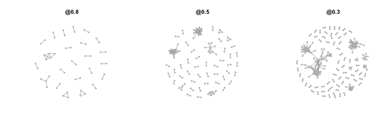 

### The LDna pipeline
A linkage disequilibrium network analysis is a powerful exploratory tool for population genomic data sets. The LDna process is iterative involving several analysis steps. Once clusters have been identified these need to be visually explored by plotting networks as well as further analysed for instance by standard analyses of  genetic structure and mapping to reference genome(s), if possible. Only then can the 'biological relevance' of an extracted cluster be assessed. In this tutorial we focus on a data set where we already know exactly which clusters correspond to inversions from extensive downstream analyses. This tutorial will not cover the downstream analyses.

In practice, one would most likely explore the data set for a while through LDna, and once reasonably satisfied, proceed with some quick downstream analyses. This information would then be fed back for a second round of LDna analyses, if necessary. This works well for reduced representation population genomic data sets with not too many loci (up to ~10000) such as RAD sequence data sets. If your data set is much larger than this, it is always possible to subsample. If the signatures of LD are strong, not more than 1000 SNPs are sometimes necessary, as will be demonstrated here. I if your data set is large, I would recommend starting with a subsample of this, say up up to 10000 SNPs (and perhaps only from a subset of chromosomes, if this information is known) to get an overall idea about what factors are causing LD in the data set before attemting to analyse the full data set.

### Produce raw data for LDna
The first step in LDna produces the raw data for all the subsequent analyses using the functions `LDnaRaw`.

```r
ldna <- LDnaRaw(LDmat)
```

### Exploring cluster merger with decreasing LD threshold
Let's first have a look at the *single linkage clustering tree*, without being concerned about which clusters to extract. To do this we set the option `extract=F`, and the only other thing we need to worry about is $|E|_{min}$, controlled by `min.edges`. As can be seen, with `min.edges=1`, all clusters (with a minimum of two loci connected by one edge) are shown and it is relatively hard to see what is going on in the tree. However, already `min.edges=5`, four separate large clades can be seen. At `min.edges=18` only these four are visible; each of them representing clusters that remain large (above $|E|_{min}$) throughout a large range of LD thresholds.

```r
par(mfcol = c(1, 3))
extractClusters(ldna, min.edges = 1, plot.tree = TRUE, extract = FALSE)
extractClusters(ldna, min.edges = 5, plot.tree = TRUE, extract = FALSE)
extractClusters(ldna, min.edges = 18, plot.tree = TRUE, extract = FALSE)
```

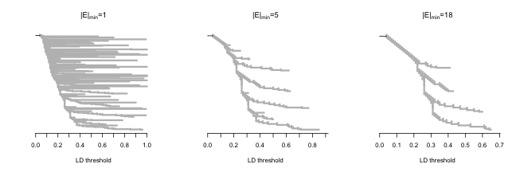 

From the above trees we can predict that at LD threshold=0.4, four clusters with at least 18 edges, 6 clusters with at least five edges and well above ~50 clusters in total exist in the network. From the above we can also see that a 'significant' merger betweeen two large clusters should happen at LD threshold=0.31. If we plot some networks again (at LD thresholds 0.32 and 0.30) we can see that this is indeed the case.

```r
par(mfcol = c(1, 2))
plotLDnetwork(LDmat = LDmat, option = 1, threshold = 0.32)
plotLDnetwork(LDmat = LDmat, option = 1, threshold = 0.3)
```

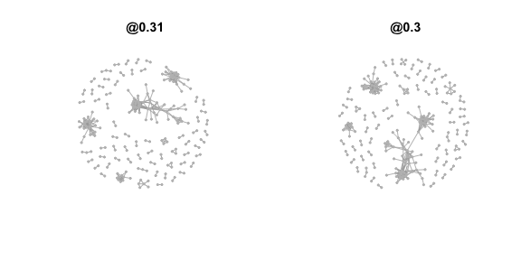 

### "Single outlier clusters" and "compound outlier clusters"
Outlier $\lambda$ values imply the merging of large and distinct clusters comprising loci bearing different LD signals (see the *LDna_basics* tutorial). However, as we can see from the trees above, there is a succession of cluster merging as the LD threshold is lowered. Along this succession only the first merger (moving form right to left along a clade in a tree) involves clusters were both are likely caused by separate distinct evolutionary factors or forces. To distinguish that a cluster is the first outlier cluster ("OC") moving from right to left along a clade, we call this "single outlier cluster", or "SOC". If an OC already is a result of the merging of two OCs (at a higher LD threshold), we call this a "compound outlier cluster", or "COC" to denote that it likely contains loci bearing different LD signals. Normally we are only interested in SOCs, but for the purpose of illustration we will next demonstrate a tree where both SOCs and COCs are indicated. This is achieved by setting the option `rm.COCs=F` in the `extractClusters` function. In this figure blue colour indicates that the cluster in question is a COC rather than a SOC (red). We set both `min.edges` and `phi` to relatively high values for this data set (14 and 5, respectively), such that we only get a few large OCs (this is covered in more detail below).

```r
par(mfcol = c(1, 2))
clusters <- extractClusters(ldna, min.edges = 10, phi = 5, rm.COCs = F, plot.tree = T, 
    plot.graph = T)
```

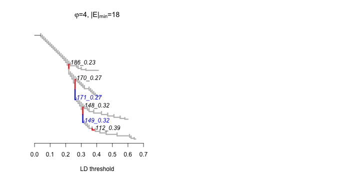 

The column: "Type" in the following summary table indicates whether an OC is a COC or a SOC. 

```r
summary <- summaryLDna(ldna, clusters, LDmat)
summary
```

```
         Type Merge.at nLoci  nE Lambda Mean.LD Mean.LD.SE
112_0.39  SOC     0.37    19  86  3.322   0.425    0.01460
148_0.32  SOC     0.31    24 100  5.143   0.302    0.01190
149_0.32  COC     0.31    51 174  3.751   0.198    0.00399
170_0.27  SOC     0.26    31 135  5.139   0.212    0.00589
171_0.27  COC     0.26   103 478  2.597   0.112    0.00170
186_0.23  SOC     0.22    16  47  2.853   0.227    0.01530
```

If we now plot all the extracted clusters (default settings), any COC will be colored blue and any SOC will be colored red. As can be seen from the above tree, COC *149_0.32* contains loci from SOCs *112_0.39* and COC *111_0.27* in turn contains loci from COC *149_0.32* and SOC *148_0.32*. Thus, the main focus should be on SOCs not COCs (but see below).

```r
par(mfcol = c(2, 3))
plotLDnetwork(ldna, LDmat, option = 2, clusters = clusters, summary = summary)
```

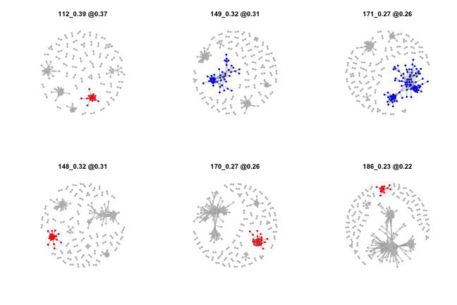 

### Identifying and extracting clusters, the effects of $\varphi$
For the follwing analyses we will keep rm.COSs=T, i.e automatically remove any *COCs* from the analyses. As seen above, the two parameters that go into the function `extractClusters` are $|E|_{min}$ and $\varphi$ controlled by the options `min.edges` and `phi`. I will first focus on $\varphi$ while keeping $|E|_{min}$ fixed (at 18). Thus, let's look at two analyses that only differ in their $\varphi$-value (2 and 3 respectively). The main difference between them is that at phi=3, instead of SOC *148_0.32* and *112_0.39* (which now are COCs) on the two bottom branches instead we now  get SOCs *90_0.47*  and *75_0.53*. In other words; OCs *47_0.46* and *90_0.47* mask OCs *148_0.32* and *112_0.39* as a *COCs* going from `phi=3` to `phi=2`.

```r
par(mfcol = c(1, 2))
clusters_4 <- extractClusters(ldna, min.edges = 18, phi = 4, rm.COCs = F, plot.tree = T, 
    plot.graph = T)
```

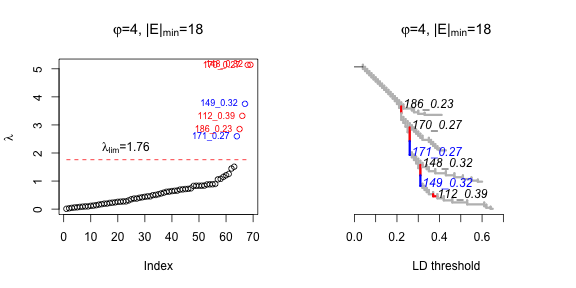 

```r
clusters_2 <- extractClusters(ldna, min.edges = 18, phi = 2, rm.COCs = F, plot.tree = T, 
    plot.graph = T)
```

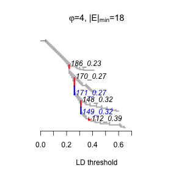 

So which setting should we use? Let's firs look at the relationship between OCs *148_0.39* and *90_0.47*. From the summary (below) we can see that the main differences are the size, mean LD and $\lambda$. Thus, if we were to use `phi=2` we would identify a SOC from the clade in question that is smaller (with respect to numbers of loci) compared to with `phi=3`. However, the mean LD in OC *90_0.47* is also significantly higher than in OC *148_0.39*. Note that in this particular case *148_0.39* is a defined as a COC (as it contains loci from *90_0.47*). Note also that the only way to access both OCs in the same analysis is to set option `rm.COCs=TRUE`.

```r
summary <- summaryLDna(ldna, clusters_2[c(2, 5)], LDmat)
summary
```

```
         Type Merge.at nLoci  nE Lambda Mean.LD Mean.LD.SE
90_0.47   SOC     0.43    14  53  1.147   0.503     0.0193
148_0.32  COC     0.31    24 100  5.143   0.302     0.0119
```

To depmonstrate why there is such a large difference in $\lambda$ between these two OCs, I will introduce a few useful aspects of the `plotLDnetwork` function. $\lambda$ is a function of both the focal cluster (cluster before merger) and the cluster/loci it merges with (see the *LDna_basics* tutorial), and we can use `plotLDnetwork` to specifically explore this. This is achieved by only showing the focal cluster and the cluster/loci it merges with by setting `full.network=FALSE` but also allowing any clusters/loci the focal cluster merges with in the network by setting `include.parent=TRUE`. In addition, we can choose to show the clusters before or after merger via `after.merger` (`TRUE` for showing network after merger and `FALSE` for before, default is `FALSE`) as follows:

```r
par(mfcol = c(1, 2))
plotLDnetwork(ldna, LDmat, option = 2, clusters = clusters_2[c(2, 5)], summary = summary, 
    full.network = F, include.parent = T, after.merger = F)
```

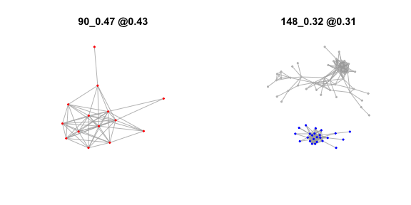 

At first, the above seems strange as for OC *90_0.47* only the focal cluster is shown (all vertices are colored red) in contrast to OC *148_0.39* (note also that OC *148_0.39* is blue as it is technically a COC). But when we then look at the networks after merger (below) we can see that indeed *90_0.47* does not merge with any cluster(s) but instead with two separate loci. Although *90_0.47* only merges with two loci, there is a large difference in the pairwise LD values between them and the remaining loci, thus giving this cluster a relatively high $\lambda$-value. This is indicated by the large difference in LD threshold values when OC *90_0.47* firstly appears (0.47) compared to when it merges with the two loci (0.43). Which one(s) of the two OCs do you then keep?. This question cannot fully be answered until all downstream analyses for both clusters have been performed. In our case I can report that all loci in OC *148_0.39* map to the same inverted region and thus `phi=3` makes the most sense (as you might have suspected).

```r
par(mfcol = c(1, 2))
plotLDnetwork(ldna, LDmat, option = 2, clusters = clusters_2[c(2, 5)], summary = summary, 
    full.network = F, include.parent = T, after.merger = T)
```

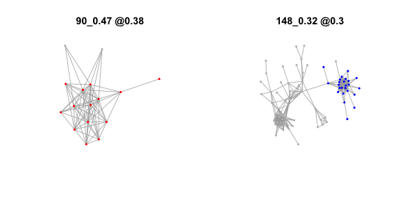 

With respect to suggestions for your own analyses, I generally consider $\varphi$ values 2-3 to be low, 3-5 to be medium and 5-8 to be high. As outlier $\lambda$ values are relative to the median of all values in the tree this is likely to be true for any data set. Going below 2 and above 8 makes little sense except for the purpose of demonstration. In practice, for smaller data sets, the merging of 'biologically relevant clusters' may not cause exceptionally high $\lambda$-values (even relative to all other values in the data) and thus, in order to not miss such mergers, it makes sense to in these cases keep $\varphi$ relatively low for small data sets. You will always get a at least one SOC from any ‘large clade’ in a tree with relatively low $\varphi$ values. The only risk with a 'too' low $\varphi$ is that you may not be able to extract the maximum possible number of loci that are associated with a particular evolutionary factor/force. On the other hand, these loci will be in higher LD with each other and in this sense low values of $\varphi$ can be considered conservative. If $\varphi$ is set 'too' high you risk missing a merger and may thus end up grouping together loci that ultimate are caused by separate evolutionary factors/forces, which is worse. However, downstream analysis can usually spot this.

There is also a possibility to use a fixed value of $\lambda_{lim}$ via the `lambda.lim` option in `excractClusters` as follows. In fact, just looking at the below figure, if you would decied upon a $\lambda_{lim}$ yourself, an appropriate value would be one, as this clearly separates two distinct groups (or 'clusters') of $\lambda$ values as demonstrated below. 

```r
clusters <- extractClusters(ldna, LDmat, min.edges = 18, lambda.lim = 2, rm.COCs = T, 
    plot.tree = FALSE, plot.graph = TRUE)
```

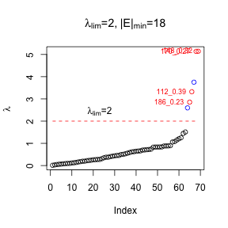 

### Identifying and extracting clusters, the effects of $|E|_{min}$
In contrast to $\varphi$, what constitutes a low and a high value for $|E|_{min}$ is highly dependent on the number of loci in the data set, more specifically the resulting average SNP density in the genome. The more loci the more likely are you to sample SNPs from small blocks of non-recombining regions of the genome, so-called haplotype blocks. These are expected to result in many small but highly 'compact' clusters involving loci from very small genomic regions. However, generally LD breaks down within roughly 10 kb in large outbreeding populations {ref} and typical population genomics data set rarely reach such SNP densities. As a rough guideline, I suggest that that a good starting value for $|E|_{min}$ is 1-2% of the total number of SNPs in the data set. In practice, if the LD signals in the data are robust, a large span of different $|E|_{min}$ values will result in exactly the same OCs. Although small OCs may potentially also be important/interesting, $|E|_{min}$ is mainly a matter of convenience; you don’t want to do all the downstream analyses for hundreds of SOCs (and the biggest ones are always likely to be the most interesting). Compare for instance the follwing example where `min.edges` is deliberately set at a relatively low value (8).

```r
clusters <- extractClusters(ldna, min.edges = 8, phi = 2, rm.COCs = TRUE, plot.tree = TRUE, 
    plot.graph = FALSE)
```

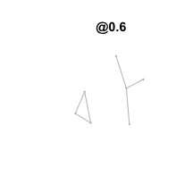 

```r
summary <- summaryLDna(ldna, clusters, LDmat)
```

Here we will focus on two smallest clusters (the remaining we already know are associated with inversions). In the example data set here, we have allowed several SNPs from each RAD locus (as long as they are informative) and these are in many cases likely to be in high LD with each other. As there are usually no more than 4 such SNPs from each RAD locus, these alone are not likely to cause large clusters. However, each restriction cut site leads to two RAD adjacent RAD loci and these as well are likely to be in high LD. As can be seen below, the three small clusters here appear to be containing several SNPs from the same RAD loci. Thus, our conclusion is that these three small clusters are mainly artifacts of the above.

```r
summary <- summaryLDna(ldna, clusters[c(3, 6)], LDmat)
summary
```

```
         Type Merge.at nLoci nE Lambda Mean.LD Mean.LD.SE
118_0.38  SOC     0.37    13 17  1.221   0.258     0.0158
194_0.21  SOC      0.2    11 14  1.438   0.172     0.0206
```

As can be seen from the networks (below), these two cluster do indeed look promising, and shows the power of LDna to identify even small but potentially interesting clusters.

```r
par(mfcol = c(1, 2))
plotLDnetwork(ldna, LDmat, option = 2, clusters = clusters[c(3, 6)], summary = summary)
```

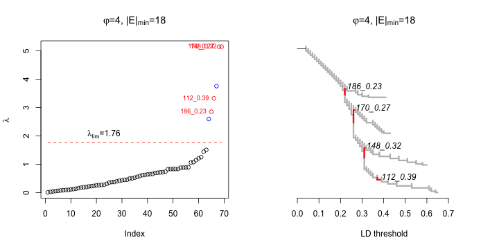 

### Final analysis
Finally, having explored the data at sufficient depth we can run the full LDna pipeline with appropriate parameter values that result in the identification of only the OCs that we know are associated with inversions (which we can only know from downstream analyses).

```r
par(mfcol = c(1, 2))
clusters <- extractClusters(ldna, min.edges = 13, phi = 4, rm.COCs = T, plot.tree = T, 
    plot.graph = T)
```

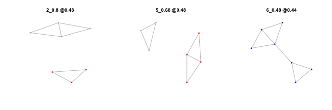 


```r
clusters
```

```
$`112_0.39`
 [1] "L4995.1"  "L9769.8"  "L3279.5"  "L665.6"   "L665.9"   "L1269.14"
 [7] "L289.1"   "L9364.4"  "L6075.5"  "L4731.7"  "L381.2"   "L6514.15"
[13] "L7312.9"  "L1191.7"  "L516.2"   "L9173.2"  "L567.1"   "L5083.16"
[19] "L7291.6" 

$`148_0.32`
 [1] "L58.3"    "L3707.1"  "L3707.3"  "L6985.17" "L3489.23" "L2270.9" 
 [7] "L4992.8"  "L625.9"   "L597.3"   "L1821.7"  "L3035.19" "L3941.13"
[13] "L3941.19" "L3924.1"  "L4845.15" "L634.4"   "L7339.6"  "L7339.9" 
[19] "L4135.17" "L4885.10" "L4885.12" "L4807.7"  "L687.5"   "L9540.5" 

$`170_0.27`
 [1] "L2458.13" "L4902.3"  "L2168.16" "L6555.6"  "L1447.2"  "L4313.16"
 [7] "L3779.7"  "L6759.1"  "L6759.2"  "L8312.4"  "L6045.3"  "L6581.17"
[13] "L5960.16" "L5631.22" "L2005.7"  "L4408.5"  "L4408.9"  "L5912.14"
[19] "L4387.1"  "L4387.7"  "L6235.3"  "L7327.4"  "L3680.16" "L5915.2" 
[25] "L5957.5"  "L5710.3"  "L5710.9"  "L5710.17" "L3575.4"  "L827.3"  
[31] "L4052.6" 

$`186_0.23`
 [1] "L12.5"    "L6044.12" "L278.6"   "L229.1"   "L6834.11" "L372.10" 
 [7] "L7024.9"  "L2434.11" "L6637.2"  "L6561.15" "L2530.9"  "L4821.4" 
[13] "L8682.10" "L6554.6"  "L3493.6"  "L5268.4" 
```


```r
summary <- summaryLDna(ldna, clusters, LDmat)
summary
```

```
         Type Merge.at nLoci  nE Lambda Mean.LD Mean.LD.SE
112_0.39  SOC     0.37    19  86  3.322   0.425    0.01460
148_0.32  SOC     0.31    24 100  5.143   0.302    0.01190
170_0.27  SOC     0.26    31 135  5.139   0.212    0.00589
186_0.23  SOC     0.22    16  47  2.853   0.227    0.01530
```

```r
par(mfcol = c(2, 2))
plotLDnetwork(ldna, LDmat, option = 2, clusters = clusters, summary = summary)
```

 

Note that there are two apporaches for choosing which OCs to keep for downstream analyeses. First, you can play around with different values of $|E|_{min}$ and $\varphi$ to find a setting that identifies exactly the SOCs you are interested in, perhaps after several rounds of downstream analyses of different OCs. Second, you can settle with a low value for both $|E|_{min}$ and $\varphi$ and then 'cherrypick' the COCs and SOCs (keeping rm.COC=F) you are mostly interested for the downstram analyses. Or even analyse them all but only report/focus on the ones that are intersting.

### Concluding remarks on the choice of $|E|_{min}$ and $\varphi$
Although what constitutes a ‘biologically relevant SOC’ cannot be known *a priori*, there are three main reasons why such theoretical SOCs would not be identified  from a given analysis: 1) $|E|_{min}$ is set too high such that the SOC in question falls below this value, 2) $\varphi$ is set too low such that the SOC in question is masked as a COC by allowing another SOC to be extracted at a higher LD threshold along the same ‘clade’, or 3) $\varphi$ is set too high such that the $\lambda$ value of the SOC in question is lower than the resulting $\lambda_{lim}$. Thus, it is necessary to explore the data set with different parameters settings for `extractClusters`, look at the resulting $\lambda$-values and tree, summarize the data (with `summaryLDna`) and then explore the clusters with `plotLDnetworks`. However, only the downstream analyses will finally reveal how 'biologically' relevant each SOC is likely to be. As such, LDna is a highly iterative process and has to be considered as an exploratory tool. It is a good idea for you to explore different values `min.edges` and `phi` to see how the OCs change. It may be also be useful for you to keep `rm.COCs=F` in order to see how a particular SOC can at some paramaeter values be a COC and vice versa.

Note that exactly what cluster you in the end decide to extract for downstream analyses does not really matter and you may not even be able to find one specific setting that allows you to extract all the OCs you are interested in. What matter is what the downstream analyses show; there is nothing wrong to initially include many different SOCs and COCs in the downstream analyses and only then decide which of them make the most sense.
